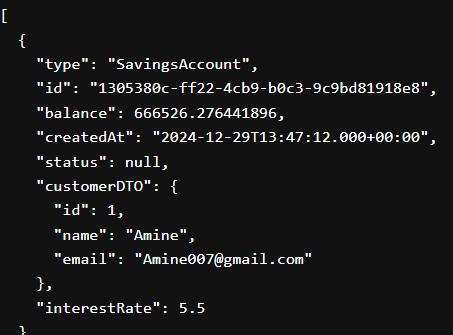
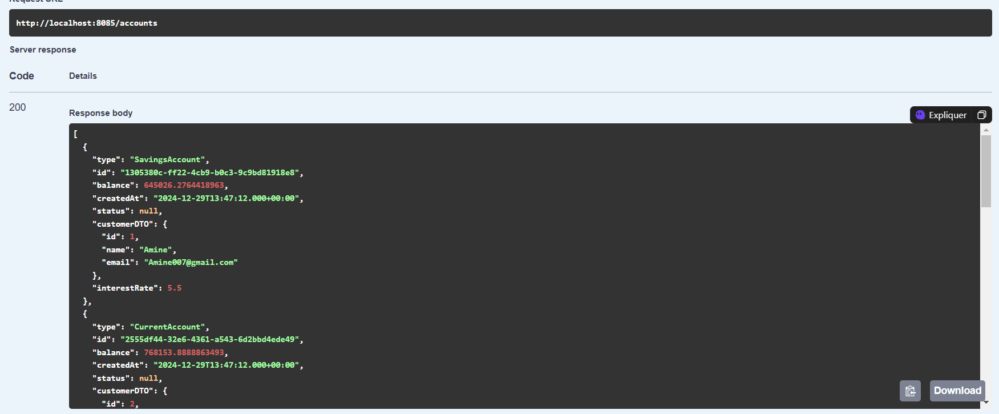

# E-Banking Application (Backend Only)

This repository contains the backend of an E-Banking application built using Spring Boot. The application allows multiple clients to have multiple accounts (either saving accounts or current accounts). Below are screenshots demonstrating various features of the backend API.

## Features

- **Add Customer**: Create new customers in the system.
- **Manage Accounts**: View accounts associated with a specific customer.
- **Transactions**: Perform operations like crediting, debiting, and transferring money between accounts.
- **API Documentation**: Access detailed API specifications via Swagger.
- **Pagination**: Retrieve paginated account operations.

## Important Note

This project includes only the backend implementation of the E-Banking application. The frontend is not included. You can interact with the API using tools like Postman, Swagger UI, or integrate it with a frontend of your choice.

## Screenshots

1. **Customer Management**:

    - **Add a new customer**:
      
    - **View all customers**:
      
    - **View customer details by ID**:
      
    - **SQL table representation of customers**:
      
    - **Swagger documentation for customer-related endpoints**:
      

2. **Account Management**:

    - **View all accounts**:
      
    - **View account details by ID**:
      
    - **Account details after a credit operation**:
      
    - **Account details after a debit operation**:
      
    - **Account details after a transfer operation**:
      
    - **SQL table representation of accounts**:
      
    - **Swagger documentation for account-related endpoints**:
      

3. **Operations**:

    - **Paginated account operations**:
      
    - **SQL table representation of account operations**:
      

4. **Testing**:

    - **Test for crediting an account**:
      
    - **Test for debiting an account**:
      
    - **Test for transferring money between accounts**:
      

## Technologies utilisées
- **Spring Boot** : Framework pour le développement backend
- **Spring Data JPA** : Pour l'accès à la base de données
- **H2 Database** : Base de données en mémoire utilisée
- **Lombok** : Pour simplifier la création des beans et réduire le code

## Auteur
Mohamed Amine RIZKI